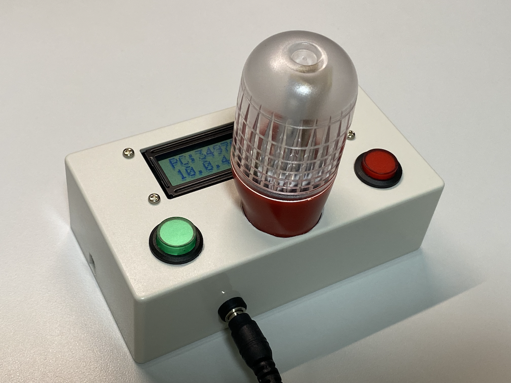
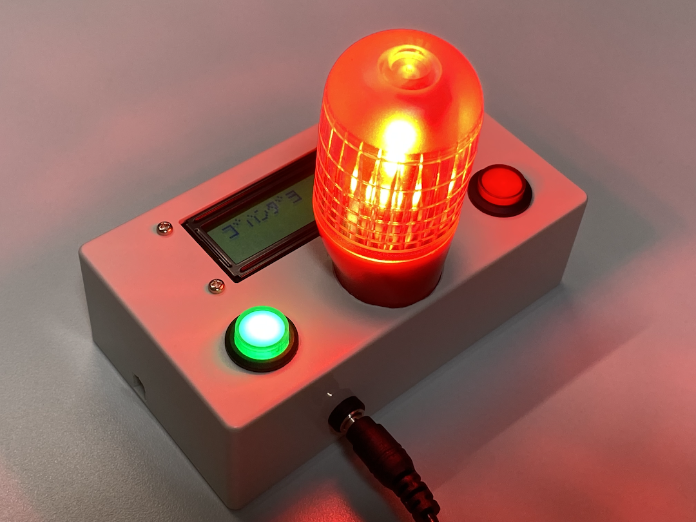
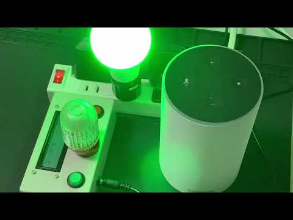
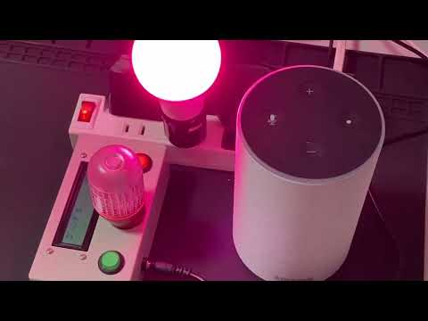
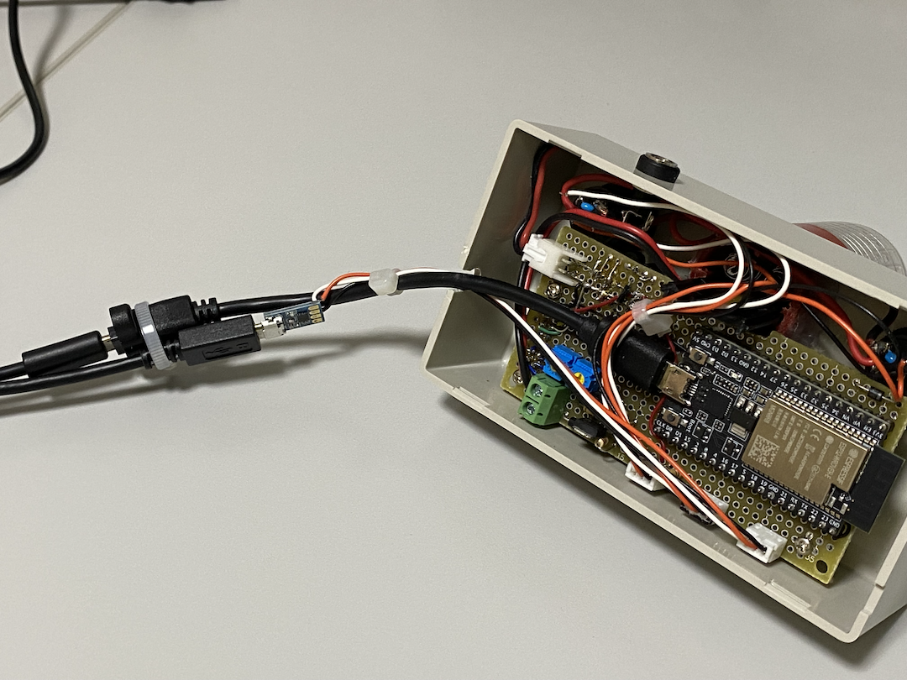
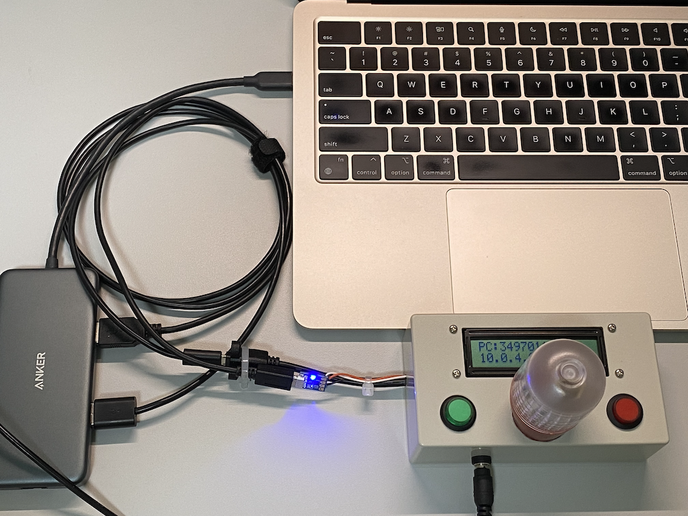
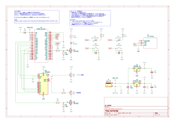

# GlimmerGo
スマートホーム規格である「[Matter](https://csa-iot.org/all-solutions/matter/)」に対応したDIYデバイスを製作してみました。  
特定の誤家庭の課題を解決するために作られたデバイスなので汎用性はありません(笑)。

### 動機
リビングと、子供部屋・仕事部屋間のミスコミニュケーションを解消したい。
- 例1:「こはんできたよ〜」と呼んでも、お父さんは会議中で返事ができずに、お母さんプンスカ！
- 例2: 朝のゴミ当番の子供がいつまでも捨てに行かずに、お母さんプンスカ！

### 要求
- リビングにいるAが、子供部屋や仕事部屋にいるB対し、何種類かの定型メッセージを届けたい。
- Aはメッセージの送信を音声でトリガしたい。またメッセージに対するOK/NGのレスポンスが欲しい。
- しかし、Bはリモート会議や電話をしているため、声によるメッセージは困る。また声によるレスポンスも即座にできないことがある。

## デバイスの概要
2つのContact Sensorと1つのDimmable Lightを内蔵しています。  
中央のFlash LightとLCDパネルがDimmable Lightに、2つの押ボタンスイッチがContact Sensorに割り当てられています。  
Matter ClientからDimmerable LightがONにされると、Flash Lightを点灯させてメッセージの到着を知らせるとともに、Brightnessの値に応じたメッセージをLCDパネルに表示します。  
Contact Sendorは、Matter対応のスマート電球と連携させることで、メッセージへの応答(OK/NG)に使用します。緑のボタンがOKを、赤のボタンがNGです。

システムコントローラには[ESP32-DevKitC-VE ESP32-WROVER-E開発ボード](https://akizukidenshi.com/catalog/g/g115674/)を使用し、ファームウェアはMatter SDKに[esp32-arduino-matter](https://github.com/Yacubane/esp32-arduino-matter/releases)を使ったArduinoのスケッチとして作られています。

### 待機状態
Matter Clientからの通知を待っている状態


### 点灯状態
Matter ClientからのMessage通知が届いた状態


### 動作ビデオ  
Amazon Echoの定型アクションを音声でトリガすることで、こはんができたことをGlimmerGoに通知します。応答として、OKボタン、NGボタンの押下でスマート電球([LDA-8WRGB-VOCE](https://ec.beamtec.co.jp/products/lda-8wrgb-voce))を10秒間点灯させます。  
| OKボタン応答 | NGボタン応答 |
|------------|------------|
|[](https://youtu.be/ICXvjUClwUg) | [](https://youtu.be/DO7ahDKVq-M)|

(注)Matter Deviceを使用するには、Matterコントローラーが必要です。このビデオではMatter非対応の第一世代Echoを使用していますが、別室に第4世代EchoがありそちらをMatterコントローラーとして使用しています。

## 開発環境
統合環境 : [ArduinoIDE](https://www.arduino.cc/en/software)  
ハードウェア : [ESP32-DevKitC-VE ESP32-WROVER-E開発ボード](https://akizukidenshi.com/catalog/g/g115674/)

ESP32上で`esp32-arduino-matter`を使用するための以下の手順を実行する必要があります。
1. `ArduinoIDE`>`基本設定`
   追加ボードマネージャのURLに以下をセット。
   ```
   https://raw.githubusercontent.com/espressif/arduino-esp32/gh-pages/package_esp32_index.json
   ```
2. `ツール`>`ボードマネージャ`
    `esp32 by Espressif`をインストールする。  
    **バージョンは後述のMatterライブラリのサポートするバージョンにすること。**
3. `ツール`>`ボード`>`esp32`
    `ESP32 Dev Module`を選択
4. C++17対応にする。
    ```Library/Arduino15/packages/esp32/hardware/esp32/2.0.14```を以下のように変更する。(`2.0.14`はインストールした`esp32 by Espressif`に依存する。)
    `-std=gnu++11` → `-std=gnu++17`
5. Matterライブラリのインストールとインストール
   1. GitHubから[esp32-arduino-matter](https://github.com/Yacubane/esp32-arduino-matter/releases)の.zipをダウンロードする。
   2. `スケッチ`>`ライブラリをインクルード`>`.ZIP形式のライブラリをインクルード`
6. ツール設定
   - `ツール`>`Partition scheme:...`>`Minimal SPIFFS (...`
   - この設定を行わないと以下のようなエラーが出る。
     ```
     Library ESP32 Arduino Matter has been declared precompiled:
     Using precompiled library in /Users/xxxxxxx/Documents/Arduino/libraries/ESP32_Arduino_Matter/src/esp32
     最大1310720バイトのフラッシュメモリのうち、スケッチが1692041バイト（129%）を使っています。
     スケッチが大きすぎます。https://support.arduino.cc/hc/en-us/articles/360013825179 には、小さくするコツが書いてあります。
     最大327680バイトのRAMのうち、グローバル変数が100204バイト（30%）を使っていて、ローカル変数で227476バイト使うことができます。
     text section exceeds available space in board

     Compilation error: text section exceeds available space in board
     ```
   - `ツール`>`Flash size:...`>`8MB (64Mb)`
   - `ツール`>`Erase All Flash Before Sketch Upload`>`Enabled`

## ファームウェアのビルドとESP32への焼き込み
1. ArduinoIDEで[GlimmerGo.ino](./Arduino/GlimmerGo/GlimmerGo.ino)を開く。  
   (注) ArduinoIDE起動時にライブラリのアップデートのポップアップが出ても無視すること。
2. [ESP32-DevKitC-VE ESP32-WROVER-E開発ボード](https://akizukidenshi.com/catalog/g/g115674/)とホストPCをUSB接続し、`スケッチ>書き込み`で、スケッチのビルドと書き込みを行う。  
   (橙白黒のケーブルはシリアルモニタ用なので焼き込みには不要。)
   
3. 焼き込みに成功すると、LCDパネルにペアリングコードとIPアドレスが表示されます。
   

## GlimmerGoの使用方法
- Matterコントローラーを用意する。
  - Amazon Echo以外での動作確認はしていません。Matter対応のEchoについては[こちら](https://www.amazon.co.jp/-/en/b?ie=UTF8&node=16450695051)を参照。
- Matterコントローラーアプリとペアリングを行う。
  - [Amazon Alexaアプリによるデバイスの設定例](./doc/AlexaApp/AlexaApp.md)を参照。

## ドキュメント
- [技術仕様書](./doc/README.md)
- 回路図
   

## License
Apache License Version 2.0