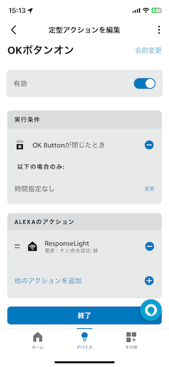

# Amazon AlexaアプリによるGlimmerGoの設定例

1. `Amazon Alexa` アプリをスマホ等にインストールし、起動する。
2. `デバイス`メニューを選択し、Matterデバイスの接続を行う。
    |1 |2 |3 |
    |----|----|----|
    | |  | |
    |4 |5 |6 |
    | |  | |
3. LCDパネルに表示されている11桁のペアリングコードを入力する。  
    |1 |2 |3 はいを選択する|
    |----|----|----|
    | |  | |
    |4 |5 デバイスが登録できた| |
    | |  | |
4. Flash Lightの設定
    |1 |2 |3 環境に合わせて設定する|
    |----|----|----|
    | |  | |
    |4 |5 |  |
    | |  | |
5. 同様にOK Buttonの設定を行う。
6. 同様にNG Buttonの設定を行う。
7. 設定が完了すると、以下が表示される。
    ||
    |----|
    ||
8. `GlimmerGO`を選択すると、Deviceの概要が表示される。
    ||
    |----|
    ||
9.  `Flash Light`を選択すると、ON/OFFと明るさの設定が行える。これを使ってFlash Lightの点灯、およびMessageのテストが可能。
    ||
    |----|
    ||
10. OKボタンオン、OKボタンオフ時の定型アクションを作成する。  
    スマート電球(ResponseLight)を**緑**に点灯させる定型アクション、および消灯させる定型アクションはあらかじめ作っておき、ALEXAのアクションに紐づける。
    |1 OKボタンオン|2 |3 |
    |----|----|----|
    |  | | |
    |1 OKボタンオフ|2 |3 |
    | | `開いている時`で設定 | `ResponseLight`は`電源:オフ`にする|
11. NGボタンオン、NGボタンオフ時も同様の定型アクションを作成する。  
    スマート電球(ResponseLight)を**赤**に点灯させる定型アクション、および消灯させる定型アクションはあらかじめ作っておき、ALEXAのアクションに紐づける。
12. Flsh Light起動用の定型アクションを作成する。  
    これで、「夕食の時間だ」で音声トリガがかかり、Flash Lightが点灯、LCDパネルに「ｺﾞﾊﾝﾀﾞﾖ」が表示されるようになる。
    |1 |2 |3 |
    |----|----|----|
    |  |  | |
    |4 |5 |6 |
    |  |  | |

## スマート電球について
スマート電球は、Beamtecの([LDA-8WRGB-VOCE](https://ec.beamtec.co.jp/products/lda-8wrgb-voce))を使用している。