# 技術仕様書

# 要件
- メッセージの送信側をA, 受信側をBとする。
- Aは、スマートスピーカーを利用してメッセージ送信をトリガする。
- Bは、以下の自作Deviceでメッセージを受信、認識、返答する。
  - メッセージを受信すると、激しめの光を点滅させる。
  - メッセージはLCDパネルに表示する。
  - OK/NGボタン押下でそのメッセージに対する返答を行う。
- 自作DeviceはMatter準拠とする。
  - LED点滅で通知状態(ON/OFF)を知らせるFlash Lightを持つ。
  - 返答用に2つのLED内蔵の物理ボタン、OKボタン(緑)、NGボタン(赤)を持つ。
  - On Off LightとDimmable LightのClusterを実装することで受信メッセージを処理する。
    - Flash LightはOn Off LightのON/OFF状態に同期させる。
    - 定型メッセージはDimmable LightのLevel値で判断し、LCDパネルに表示する。
  - 2つのContact SensorのClusterを実装し、OKボタン、NGボタンを割り当てる。
    - ボタン押下でSensorがON状態にする。一定時間後(10秒)に自動的にOFFに戻す。
  - Deviceのコミッショニングのため、LCDパネルに11桁のPairing Codeを表示する。QR Codeには対応しない。
  - (言うまでもなく)Matter認証には非対応。
- Amazon Alexaを使用する場合
  - AからBへの通知
    - Dimmable LightのLevelでメッセージを指定するような定型アクションを定義する。
    - Aは音声により、この定型アクションをトリガする。
  - BからAへの通知
    - Matter準拠のスマート電球を点灯させることで返答を行う。Aは電球の色でメッセージに対するOK/NGを識別する。
    - Contact Sensorでスマート電球の色設定とON/OFFを行う定型アクションを作成する。OKボタンの押下で緑の点灯、NGボタン押下で赤の点灯を行う。

# ソフトウェア仕様
## Matter Device構造


### On Off Light　Cluster
Matter ClientからON/OFFが指示されたら、Flash Lightを点灯/消灯させる。

### Dimmable Light Cluster
Matter ClientでセットされるBrightness(%)を`dimmer_level`に変換された値として受信する。
受信を検知したら、Flash Lightを点灯させるとともに、`dimmer_level`に対応するMessageをLCD Displayに表示する。

|Brightness (%)|dimmer_level|Message |
|:--------:|:---------:|--------|
|  1 -  19 |   0 -  51 | ｻﾗ ｱﾗｴ  |
| 20 -  39 |  52 - 102 | ｺﾞﾐ ｽﾃﾛ |
| 40 -  60 | 103 - 153 | ｾﾝﾀｸﾓﾉ  |
| 61 -  80 | 154 - 204 | ﾁｮｯﾄｺｲ  |
| 81 - 100 | 205 - 255 | ｺﾞﾊﾝﾀﾞﾖ |

### Contact Sensor Cluster
OKボタンをendpoint_1のContact Sendor 1に、NGボタンをendpoint_2のContact Sendor 2に割り当てる。

## Deive制御
[esp32-arduino-matter](https://github.com/Yacubane/esp32-arduino-matter/tree/master?tab=readme-ov-file)を使用しているため、Device制御のコンテキストは[esp-idf](https://github.com/espressif/esp-idf)のフレームワーク内で動作する。ただしAruduinoのスケッチなので、システム起動時に`setup()`が1回だけ呼び出され、以後`loop()`が定期的に呼び出されるのは、Arduinoのフレームワークと変わりない。

`setup()`では、GPIOやLCD、割り込み等のペリフェラルの初期化後、State Machineを起動する。

`loop()`では、イベントキューからEventオブジェクトを取り出し、`handleEvent()`でState Machineに渡して内部状態を変更する。

Eventオブジェクトは、Matter SDKのコールバック、タイマ発火時、ボタン押下など、非同期にキューにセットされる。

### Eventオブジェクト
EventオブジェクトによりState Machineを駆動する。EventはTypeと1つのパラメータを持つことができる。
| Event Type    | Parameter    | 用途                  |
|---------------|--------------|----------------------|
| INIT_COMPLETE | None(0)      | システム初期化完了   　　|
| START_FLASH   | dimmer_level | Flash Lighの点灯、メッセージのLCD表示要求 |
| STOP_FLASH    | None(0)      | Flash Lightの消灯     |
| OK_PRESSED    | None(0)      | OK Button押下         |
| NG_PRESSED    | None(0)      | NG Button押下         |
| TIMER_EXPIRED | None(0)      | Timer発火             |
| IP_CHANGED    | None(0)      | IP address 変更       |

### State Machine


### Actions
|Action|Parameter||
|--------------------|--------|----|
|StartTimer()        | N      | Timerを起動。N(ms)経過後にイベント`TIMER_EXPIRED`が発生する。 |
|StopTimer()         |        | Timerを停止する。 |
|SetSwitchOK()       | bState | Contact Sensor 1 (endpoint_1)の状態をセットする。trueでON, falseでOFF。 |
|SetSwitchNG()       | bState | Contact Sensor 2 (endpoint_2)の状態をセットする。trueでON, falseでOFF。 |
|SetAttr_FlashLight()| bState | Dimmable Light (endpoint_3)の状態をセットする。trueで点灯, falseで消灯。 |
|TurnOn_FlashLight() |        | Flash Lightを物理的に点灯させる。 |
|TurnOff_FlashLight()|        | Flash Lightを物理的に消灯させる。 |
|SetTwinkleLED()     | bOKState, bNGState | OKボタン/NGボタンのLEDの点滅状態を変更する。trueで点滅開始、falseで消灯。 |
|TurnOn_LED()        |        | ボタンLED、LCDバックライトを点灯させる。 |
|TurnOff_LED()       |        | ボタンLED、LCDバックライトを消灯させる。 |

## 実装メモ
### Pairing CodeやQR Code URLを取得する方法
- [esp-matter](https://github.com/espressif/esp-matter)の以下のファイルと関数を参照。
    - ファイル: [esp-matter/connectedhomeip/connectedhomeip/src/app/server/OnboardingCodesUtil.cpp](https://github.com/espressif/connectedhomeip/blob/1dc089ce965e6b627b4c4ecd08b0e1882ece6b53/src/app/server/OnboardingCodesUtil.cpp)
    - 関数: `PrintOnboardingCodes()`
      - シリアルのログに、Pairing CodeとQR Code URLが表示する。

- サンプル
  - PrintOnboardingCodes()の呼び出し方法
    ```C++
    PrintOnboardingCodes(chip::RendezvousInformationFlag(chip::RendezvousInformationFlag::kBLE));
    ```

  - Pairing Codeの文字列を取得する方法
    ```C++
      char payloadBuffer[32];
      chip::MutableCharSpan manualPairingCode(payloadBuffer);
      if (GetManualPairingCode(manualPairingCode, chip::RendezvousInformationFlag::kBLE) == CHIP_NO_ERROR) {
        Serial.println(manualPairingCode.data());
        //ChipLogProgress(AppServer, "Manual pairing code: [%s]", manualPairingCode.data());
      } else {
        Serial.println("Pairing Code Error!!");
        //ChipLogError(AppServer, "Getting manual pairing code failed!");
      }
    ```

### cluster_id, attribute_idの定義
- 定義例
  ```C++
  const uint32_t CLUSTER_ID_DIMMABLE_LIGHT   = OnOff::Id;
  const uint32_t ATTRIBUTE_ID_DIMMABLE_LIGHT = OnOff::Attributes::OnOff::Id;
  ```
- ヘッダファイル
  - [esp-matter/connectedhomeip/connectedhomeip/zzz_generated/app-common/app-common/zap-generated/ids/Clusters.h](https://github.com/espressif/connectedhomeip/blob/v1.1-branch/zzz_generated/app-common/app-common/zap-generated/ids/Clusters.h)
  - [esp-matter/connectedhomeip/connectedhomeip/zzz_generated/app-common/app-common/zap-generated/ids/Attributes.h](https://github.com/espressif/connectedhomeip/blob/v1.1-branch/zzz_generated/app-common/app-common/zap-generated/ids/Attributes.h)

## 文献
- Matter
  - [CSA (Connectivity srandards aliance)](https://csa-iot.org/)
  - [Matter仕様書](https://csa-iot.org/developer-resource/specifications-download-request/)
- ESP32 Matter SDK
  - [arduino-esp32](https://github.com/espressif/arduino-esp32)
  - [esp-idef](https://github.com/espressif/esp-idf)
  - [esp-matter](https://github.com/espressif/esp-matter)
  - [connecthomeip](https://github.com/espressif/connectedhomeip)
- 参考記事
  - [【解説】スマートホーム共通規格「Matter」](https://techlabo.ryosan.co.jp/article/24011209_1048.html)
  - [ESP32 (arduino) からAlexaの定型アクションをトリガーしよう](https://qiita.com/wanko_in_lunch/items/68a7be306281aa43fc4b)
  - [ESP32でMatterな接触センサを自作しよう　複数センサ編](https://qiita.com/wanko_in_lunch/items/71316e839f304cc66d6b)
  - [ESP32でMatterな接触センサを自作してAlexa定型アクションを叩こう](https://qiita.com/wanko_in_lunch/items/70ec071083d3c5172880)

# ハードウェア仕様
## 回路図


## 電源
- 外部電源は、9V / 1AのACアダプタ推奨。  
- LCDパネルのバックライト用に、3端子レギュレータで5Vを生成している。熱損失による温度上昇が気になるので、外部電源電圧は9V程度に抑えたい。
- 3.3V系は、三端子DC/DCレギュレーター([BP5293-33](https://akizukidenshi.com/catalog/g/g111187/))で生成。USB電源との衝突防止のため、ショットキーバリア 1S4で分離している。
- Flash Lightの電源は、念の為IN4007で3V以下に降圧させている。

## デバッグ用UART
- ESP32のTX/RX端子をコネクタで接続できるようにし、外部のUSBシリアル変換モジュール[AE-FT234X](https://akizukidenshi.com/catalog/g/g108461/)で変換してホストに接続できるようにしている。
- ArduinoIDEのシリアルモニタで表示ができる。

## パーツ
[BOM](../KiCad/GlimmerGo/BOM.csv)

- コントローラ
  - [ESP32-DevKitC-VE ESP32-WROVER-E開発ボード](https://akizukidenshi.com/catalog/g/g115674/)を使用。
  - Micro USBコネクタでホストに接続して開発を行う。
  - GPIOはたくさんあるように見えるが、制約があり使用できるピンは限られるので注意。([参考情報](https://robot-jp.com/wiki/index.php/Parts:DevBoard:ESP32-DevKitC-32D))
- 押しボタンスイッチ
  - [LED付きプッシュスイッチ R16-503BD](https://www.aitendo.com/product/3599)
  - LEDの詳細が不明なため、電流制限抵抗は現物あわせ。
- LCDパネル
  - [LCDキャラクタディスプレイ 16×2行 3.3V仕様 バックライト付](https://akizukidenshi.com/catalog/g/g114443/)
  - バックライト電源は3.3Vでは不足。5Vを分圧調整している。
  - マニュアルと表示方向が逆？おかげでメッセージの表示が見にくくなってしまった。
- 筐体
  - [プラスチックケース SW-125S(LCD)](https://akizukidenshi.com/catalog/g/g109834/)
  - LCDパネル用の穴加工済みなので便利。が、W:70mm/D:125mm/H:40mmのサイズにパーツを全て押し込めなければならなくなった...。
- Flash Light  
  [エーモンの非常信号灯](https://www.amon.jp/products2/detail.php?product_code=6904)を使用した。3V(単4アルカリ電池2個)でLEDの点滅を行ってくれる。  
  以下のように外殻だけを切断し、電池の接点にコードを接続し、FET 2SK2925でON/OFF制御を行う。  
  |加工前|加工後|
  |-----|-----|
  | | |

